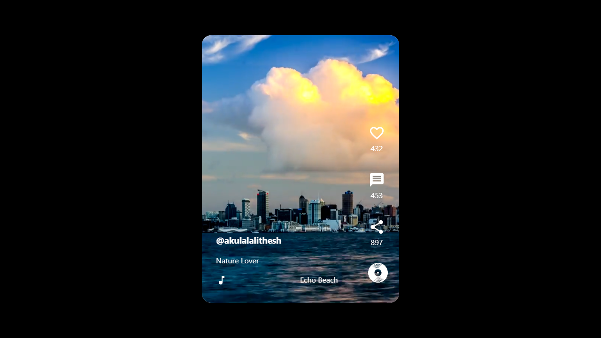

# TikTok-clone

[Website](https://tiktok-clone-e9d1e.web.app/)

### Overview of the project:

It is a <strong>tiktok-clone</strong>. I have deployed the Frontend in Firebase & Backend in Heroku.

### Steps:

1. After opening the websiste simply scroll down/up to view the videos.
2. To play or pause the videos click on the video screen.
3. Stored the video details like video url, channel name, likes, shares, messages, song details using the MongoDB Atlas.
4. Used the ExpressJS for creating the APIs. And hosted the backend in the Heroku.

Technologies used are <strong>ReactJS, ExpressJS, MongoDB, NodeJS</strong>